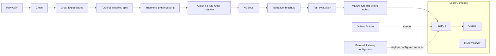

# Telco Customer Churn MLOps

## Overview

This repository implements a modular churn-prediction workflow for the Telco Customer Churn dataset: cleaning, Great Expectations validation, stratified splitting, Optuna/XGBoost training, validation-based threshold selection, MLflow tracking, a self-contained inference artifact, FastAPI, Gradio, Docker Compose, and GitHub Actions.

It is an MLOps foundation rather than a complete production platform. Monitoring, drift detection, automated promotion, and rollback are not implemented. Railway configuration is external to this repository.

## Business Problem

The model predicts customer churn. Recall is prioritized because missing a likely churner can prevent retention action. Training enforces minimum validation precision `0.40`, then selects the threshold with highest recall and F1 among valid candidates. No ROI or intervention policy is claimed.

## Architecture



MLflow is local tracking/registry infrastructure. The API serves the bundled artifact and does not require MLflow at inference time.

## Project Status

| Capability | Status |
|---|---|
| Cleaning, data validation, stratified splitting | Implemented |
| Optuna/XGBoost training and threshold selection | Implemented |
| MLflow tracking and registered pyfunc logging | Implemented locally |
| Self-contained tracked inference artifact | Implemented; artifact v2 |
| FastAPI, Gradio, Docker Compose | Implemented |
| Unit/integration tests and CI | Implemented |
| Pipeline smoke workflow | Implemented separately from standard CI |
| Railway deployment | Externally configured; repository evidence is limited |
| Monitoring, drift detection, promotion, rollback | Not implemented |

## Technology Stack

Python 3.12, pandas, NumPy, scikit-learn, XGBoost, Optuna, Great Expectations, MLflow, FastAPI, Pydantic, Uvicorn, Gradio, Requests, Docker, Docker Compose, GitHub Actions, pytest, and Railway.

## Repository Structure

```text
src/api/                 FastAPI application, schemas, and service
src/ui/                  Gradio application
src/clean.py             Cleaning and target encoding
src/validate_data.py     Great Expectations validation
src/split_data.py        Stratified split
src/preprocess.py        Numeric/categorical preprocessing
src/tune.py              Optuna search and CV
src/train.py             XGBoost fitting
src/select_threshold.py  Threshold selection
src/evaluate.py          Test metrics
src/model_artifact.py    Self-contained MLflow pyfunc model
scripts/run_pipeline.py  Canonical training orchestration
tests/                   Unit, API, artifact, UI, and smoke tests
model/                   Tracked inference artifact and metadata
.github/workflows/       CI and pipeline smoke workflow
Dockerfile, Dockerfile.ui, Dockerfile.mlflow, compose.yaml
```

## Data and Validation

The current raw CSV is 7,043 rows by 21 columns: `customerID`, 19 raw features, and `Churn`. Churn has 5,174 `No` and 1,869 `Yes` values. It is ignored by Git and expected at:

```text
data/raw/WA_Fn-UseC_-Telco-Customer-Churn.csv
```

Cleaning normalizes names and strings, drops `customerID`, converts `TotalCharges` to numeric, fills invalid/missing values with `0`, and maps the target to `0/1`. The observed file has 11 blank `TotalCharges` values.

Great Expectations validates the cleaned 20-column dataset: required columns, no nulls, allowed categories, binary `SeniorCitizen`/`Churn`, tenure `0..72`, and non-negative charges. Validation runs before splitting. No dataset source URL or license is documented.

## Machine Learning Pipeline

The canonical entry point is `scripts/run_pipeline.py`.

- Split: 70% train, 15% validation, 15% test; stratified; `random_state=42`.
- Preprocessing: `StandardScaler` for numeric fields and `OneHotEncoder(handle_unknown="ignore")` for categorical fields, fitted on train only.
- Tuning: 100 Optuna trials by default; 5-fold cross-validation; recall objective.
- XGBoost: best Optuna parameters, `random_state=42`, `eval_metric="logloss"`.
- Thresholds: `0.05..0.50` in `0.01` steps; precision must be at least `0.40`; maximize recall, then F1.
- Test metrics are computed after threshold selection on validation data.

The Optuna sampler is not explicitly seeded, so the full search is not guaranteed bit-for-bit reproducible.

## Model Performance

These are the authoritative values embedded in the tracked v2 artifact and its associated test evaluation, not smoke-test metrics:

| Threshold | Accuracy | Precision | Recall | F1 |
|---:|---:|---:|---:|---:|
| 0.10 | 0.6206 | 0.4054 | 0.9146 | 0.5617 |

No authoritative AUC, calibration, or business-cost metric is currently recorded.

## MLflow, Registry, and Provenance

The experiment is `Telco-Customer-Churn`. The current pipeline logs seed, artifact version, threshold, trial count, minimum precision, best parameters, dataset dimensions/source/SHA-256, Git commit, test metrics, model signature, and input example.

The registered model name is `TelcoChurnXGBoost`. The tracked metadata identifies artifact version `1.0.0`, registry version `2`, and run `8dbd192a66df423588c5390ebe5ff4cc`. The local MLflow database contains historical records but is ignored and is not a portable production control plane.

The v2 MLflow run contains source commit `39fe2a1e909e2775c8973a0cf33e4755bcc4bb77` and source `scripts\\run_pipeline.py`. It does not contain all custom provenance fields now emitted by the pipeline; `model/MLmodel` itself has no Git commit.

Fixed split/XGBoost seeds, model parameters, artifact runtime metadata, dataset fingerprinting, and Git tags improve reproducibility. They do not guarantee exact retraining because the Optuna sampler, raw data, and local MLflow state are not fully versioned.

## Inference Artifact

`src/model_artifact.py` bundles the cleaner, fitted preprocessor, classifier, and threshold in one MLflow pyfunc model. It accepts and validates the 19 raw features in serving order, applies the training preprocessing, calls `predict_proba`, and returns `churn_probability` and `churn_prediction`. The decision is `1` for probability greater than or equal to the embedded threshold. Metadata includes schema, threshold, parameters, test metrics, artifact version, and runtime versions. This reduces train/serve skew.

## FastAPI API

Application: `src.api.main:app`.

| Endpoint | Behavior |
|---|---|
| `GET /` | Service information and docs link |
| `GET /health` | Model check; failure returns `503` |
| `POST /predict` | Validates 19 raw features and returns probability, label, and model URI |

Invalid Pydantic payloads return `422`; service/model failures return `503`. Extra fields are rejected. Example request:

```json
{
  "gender": "Female", "SeniorCitizen": 0, "Partner": "Yes", "Dependents": "No",
  "tenure": 1, "PhoneService": "No", "MultipleLines": "No phone service",
  "InternetService": "DSL", "OnlineSecurity": "No", "OnlineBackup": "Yes",
  "DeviceProtection": "No", "TechSupport": "No", "StreamingTV": "No",
  "StreamingMovies": "No", "Contract": "Month-to-month",
  "PaperlessBilling": "Yes", "PaymentMethod": "Electronic check",
  "MonthlyCharges": 29.85, "TotalCharges": 29.85
}
```

Launch with:

```powershell
python -m uvicorn src.api.main:app --host 127.0.0.1 --port 8000
```

`MODEL_URI` selects the artifact; Compose uses `/app/model`.

## Gradio UI

`src/ui/app.py` provides 19 controls and sends requests to the API; it does not perform inference. `API_URL` defaults to `http://127.0.0.1:8000` and Compose sets it to `http://api:8000`. It listens on port 7860:

```powershell
python -m src.ui.app
```

## Docker and Local Services

Compose defines `mlflow` on port 5000, `api` on 8000, and `ui` on 7860. The UI depends on the healthy API. The API image bundles `/app/model`; MLflow is not needed for serving. MLflow uses local `mlflow.db` and `mlartifacts` bind mounts, both ignored by Git.

```powershell
docker compose config -q
docker compose up -d --build
docker compose ps
docker compose down
```

CI validates Compose syntax and builds API/UI images, but does not run a runtime container smoke test or build the MLflow image.

## CI and Testing

Standard CI runs on pushes to `main`/ `deploy/railway` and pull requests to `main`. It installs dependencies, validates Compose, compiles Python, runs tests except `tests/test_pipeline_smoke.py`, and builds API/UI images.

The separate smoke workflow runs for ML-related paths or manual dispatch. It executes real orchestration on a synthetic temporary Telco-like dataset, temporary MLflow storage, and one Optuna trial; it reloads the artifact and checks predictions/provenance. Synthetic metrics are not production performance.

Tests cover cleaning, splitting, preprocessing, thresholding, evaluation, validation, API, artifact reload/parity, UI mapping, and pipeline orchestration. Latest local result:

```text
24 passed, 1 warning in 74.49s
```

The warning is a Starlette/AnyIO deprecation warning. Coverage is not measured.

## Deployment

Local development can run MLflow, API, and UI with Compose. The API Dockerfile honors Railway's `PORT`; the UI image starts Gradio.

GitHub deployment records show Railway production deployments associated with `main`, but the repository contains no Railway configuration file, public URL, or versioned service mapping. No GitHub Action performs deployment. Railway is therefore externally configured rather than reproducible from repository files. The tracked production artifact is v2; this README does not create or promote a model version.

## Running Locally

The dataset must be obtained separately and placed at the path above:

```powershell
git clone <repository-url>
cd Telco-Customer-Churn-ML
python -m venv .venv
.\.venv\Scripts\Activate.ps1
python -m pip install -r requirements.txt
python -m pip install -r requirements-dev.txt
python -m pip install -r requirements-ui.txt
python -m pytest -q
docker compose up -d --build
Invoke-RestMethod http://127.0.0.1:8000/health
```

Training uses the canonical script and the local MLflow address `http://127.0.0.1:5000`:

```powershell
python scripts/run_pipeline.py
```

The default is 100 Optuna trials; the smoke test uses one trial and temporary data/storage.

## Prediction Flow

```text
raw JSON (19 features)
 -> Pydantic validation
 -> pyfunc artifact
 -> cleaning and fitted preprocessing
 -> XGBoost predict_proba
 -> embedded threshold (v2: 0.10)
 -> churn_probability and churn_prediction
```

## Current Limitations and Roadmap

- [x] Data validation, modular training, MLflow tracking, packaged preprocessing/classifier/threshold
- [x] API/UI separation, tests, Docker images, CI, pipeline smoke workflow
- [ ] Version dataset and MLflow state portably; the dataset/source/license are currently undocumented
- [ ] Add inference logs, monitoring, drift detection, and alerting
- [ ] Define automated promotion and rollback
- [ ] Add Docker runtime smoke tests
- [ ] Version Railway configuration and document service URLs
- [ ] Seed the Optuna sampler and fully pin UI dependencies

## MLOps Concepts Demonstrated

Data validation, modular training, stratified evaluation, threshold optimization under a precision constraint, experiment tracking, provenance, model packaging, train/serve parity, API/UI separation, testing, containerization, CI, and externally managed deployment.

## Dataset Attribution / License

No dataset source URL or dataset license is documented, and no repository `LICENSE` file is present. Attribution and redistribution terms should be added before publishing or redistributing the data or a derived distribution.
